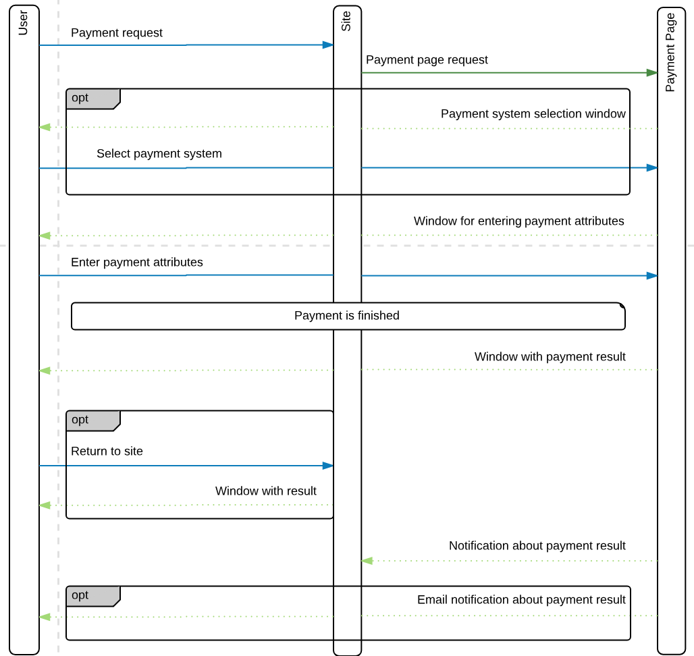

# EcommPay PHP SDK

This is a set of libraries in the PHP language to ease integration of your service with the EcommPay Payment Page.

The following functionality is implemented:

* Payment Page openning 
* Notifications handling

Please note that for correct SDK operating you must have at least PHP 5.0 (or higher).  

## Payment flow



## Installation

* Clone / download this SDK from the repository
* Configure the SDK, e.g. as follows:
  1. Open `/config/config.php`
  2. Set `SECRET_KEY` to the value provided by EcommPay
* Load it: 
    ```php
    require ‘pmx.php’; // include SDK libraries
    use Gate\Gate;     // use Gate namespace
    ```

## Payment Page openning

You'll need to autoload this code in order to get signed url for user's redirect on the Ecommpay Payment Page:

```php
require ‘pmx.php’;
use Gate\Gate;
$gate = new Gate();
$url = $gate->getPurchasePaymentPageUrl(
    string $project_id,
    string $payment_id,
    integer $payment_amount,
    string $payment_currency = ‘RUB’,
    string $customer_id = ‘’,
    string $payment_description = ‘’,
    string $language_code = ‘’
);
``` 

`$url` here is the signed url.

Parameter | Required | Format | Description
---------|---------|---------|---------
`project_id` | yes | string | Unique id of your project in the Payment Page
`payment_id` | yes  | string | Unique id of the payment in your system
`payment_amount` | yes | integer | Payment amount in minor units
`payment_currency` | no | string | Currency in ISO 4217 alpha-3
`customer_id` | no | string | Customer id
`language_code` | no | string | Payment page language in ISO 3166-2. Its default is determined by `region_code` parameter.

## Notifications handling

You'll need to autoload this code in order to handle notifications:

```php
require ‘pmx.php’;
use Gate\Gate;
$gate = new Gate();
$callback = $gate→handleCallback($jsonData);
```

`$jsonData` is the JSON data received from payment system;

`$callback` is the Callback object describing properties received from payment system;
`$callback` implements these methods: 
1. `Callback::getPaymentStatus();`
    Get payment status.
2. `Callback::getPayment();`
    Get all payment data.
3. `Callback::getPaymentId();`
    Get payment id in ypur system.